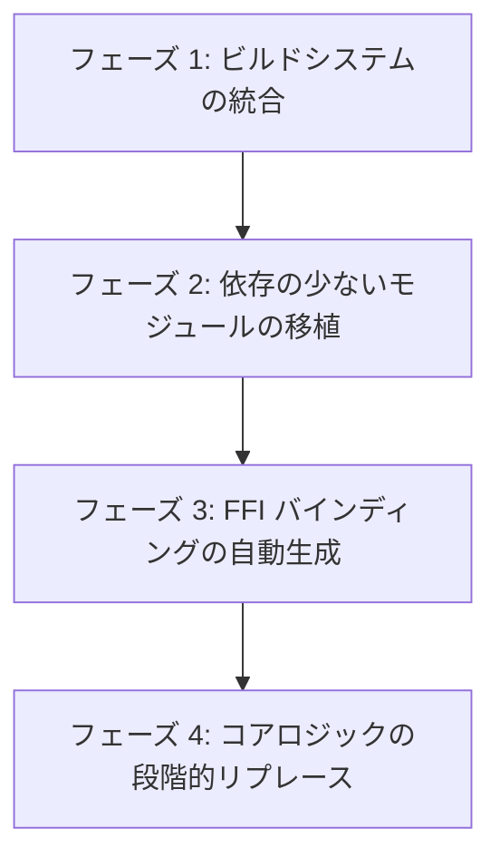

# Neovim to Rust 移植プロジェクト方針 (GEMINI.md)

本プロジェクトは、C言語で記述された **Neovim (v0.12.2)** を **Rust** へ移植（ポーティング）することを目的としています。

---

## 移植戦略：FFIハイブリッド方式によるインクリメンタルな置換 (アプローチ A)

Neovim は 10 万行を超える大規模な C コードベースであり、多くのグローバル状態やポインタ操作が含まれています。安全かつ確実に移植を進めるため、**「既存の C コードと Rust コードを FFI 経由で共存させ、徐々に Rust に置き換えていくインクリメンタルなアプローチ」** を採用します。

### 本アプローチのメリット
- **常に動作するエディタを維持できる**: 各ステップでビルドと動作確認、テストの実行が可能です。
- **バグの早期発見**: 移植したモジュールごとに Neovim 既存の膨大なテストスイート（機能テストやユニットテスト）を実行し、デグレが発生していないかを確認できます。

---

## 今後のロードマップ

移植作業は以下のフェーズに沿って進めます。

### フェーズ 1: ビルドシステムの統合
1. Rust プロジェクト (`reovim`) をスタティックライブラリ (`staticlib`) としてビルドできるように `Cargo.toml` を構成する。
2. Neovim 側の CMake ビルドシステム (`CMakeLists.txt`) を修正し、ビルド時に自動的に Cargo を呼び出して Rust のスタティックライブラリ (`.a`) をリンクする構成を作る。
3. Rust 側でダミー関数 (例: `hello_from_rust()`) を作成し、C 側の `main.c` の起動シーケンスから呼び出して動作確認を行う。

### フェーズ 2: 依存の少ないモジュール (末端モジュール) の移植
他への依存が少なく、自己完結しているユーティリティやヘルパーモジュールから順に Rust に書き換えます。
- **候補モジュール**:
  - `src/nvim/sha256.c` (暗号化処理)
  - `src/nvim/path.c` (パス操作ヘルパー)
  - `src/nvim/map_glyph_cache.c` (グリフキャッシュ)

### フェーズ 3: FFI バインディングの自動生成
- Rust 側から Neovim 内部 of C 構造体 (ウィンドウやバッファの情報など) にアクセスできるように、`bindgen` 等を導入して C 側の型定義やヘッダー情報を自動的に Rust にインポートする仕組みを構築します。

---

## 現在のビルド確認状況 (2026-06-09 時点)

- **Rust プロジェクト (`reovim`)**: `cargo check` により正常にコンパイルできることを確認済み。
- **Neovim 本体 (`vim_src/neovim-0.12.2`)**:
  - 依存ツール (`cmake`, `ninja`) をインストール済み。
  - `make CMAKE_BUILD_TYPE=RelWithDebInfo` で正常にコンパイルでき、バイナリ (`./build/bin/nvim`) が動作することを確認済み。
